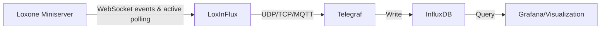

# LoxInFlux

[](https://opensource.org/licenses/MIT)


> ⚠️ This project is in no way affiliated with Loxone, software, company or its developers.

LoxInFlux is a Python application that collects metrics from your Loxone Miniserver and forwards them to Telegraf, enabling you to store and visualize your smart home data in time-series databases like InfluxDB.

Whilst it is called LoxInFlux it is mainly a (one way) bridge between Loxone Miniserver and Telegraf, so in theory it is possible to not just output to Influx but to all outputs that are supported by Telegraf.

LoxInFlux is heavily inspired by the fabulous Loxberry Plugin "Stats4Lox (NG)", which many have used for years, but follows a more oppinionated approach:
- LoxInFlux hooks into the Websocket of the Miniserver, which propagates all updates of controls, that are a) set to visible and b) have a category or c) are linked to an control that meet a) & b). All of these are forwarded to Telegraf
- For all other controls a grabber is used which actively requests information (via Websocket) in an defined interval
- There is no GUI, no selection of individual data fields, no collection of individual mqtt topics, ... . It's mostly all-or-nothing. While LoxInFlux has some basic filtering / blacklisting functionality (see below), the main idea is to leverage the capabilities of Telegraf to do this kind of stuff with its much more capable processors / aggregators (see examples below)



> ⚠️ InfluxDB also allows writing to STDOUT in accordance with Telegrafs EXECD-Plugin specification - so it should be able to run as EXECD daemon - but it is not yet tested

## Quick Start

```bash
# 1. Get the configuration template (config/default_config.toml)
mkdir -p config
curl -o config/config.toml https://raw.githubusercontent.com/JakobGliwa/loxinflux/main/config/default_config.toml

# 2. Edit config/config.toml with your settings
# If run locally, the application excepts the config folder to be in the same directory as the src folder. Under docker it is expected to be the folder mapped to /app/config

# 3. Run with Docker
docker run -d \
  --name loxinflux \
  -e TZ="<your timezone>" \
  -v $(pwd)/config:/app/config \
  -v $(pwd)/data:/app/data \
  --restart unless-stopped \
  jakobgliwa/loxinflux:latest
```

## Features

- Collects metrics from Loxone Miniserver via WebSocket or periodic polling
- Forwards data to Telegraf via various protocols (UDP, TCP, MQTT, or stdout)
- Configurable filtering of control types and UUIDs
- Docker support for easy deployment
- Automatic reconnection handling
- Configurable data rounding for float values to help Telegraf filters

## Data Format

LoxInFlux collects metrics from your Loxone Miniserver and forwards them to Telegraf in InfluxDB Line Protocol format:

```
loxone,uuid=12345678-1234-1234-1234123456789012,type=TEMPERATURE,name=TemperatureKitchen,... value=21.5
loxone,uuid=87654321-4321-4321-4321210987654321,type=HUMIDITY,name=HumiditySensorKitchen,... value=45.2
```

Each metric includes:
- Measurement name: Always "loxone"
- Tags:
  - uuid: Unique identifier of the control as per Loxone Configuration / JSON-Definition
  - subuuid: Unique identifier of individual fields of a control as per Loxone Config
  - type: Control type (e.g., TEMPERATURE, HUMIDITY)
  - name: Control name from Loxone Config
  - statstype: Type of stats item
  - unit: Unit (if set in the configuration)
  - category: Category set in Loxone Config
  - room: Room the control is set to
  - source: Will either be websocket or grabber 
  - visu: Wether the control is set to visible in the Loxone Config
  - application: Set always to loxInFlux
- Field: value (the actual measurement)

> ⚠️ InfluxDB tags generated by LoxInFlux are inspired by the way Stats4Lox handled it, but I can not guarantee that all value formats will be the same. If you plan on continuing your Stats4Lox history, consider leveraging the capabilities of Telegraf to remap data where necessary.

## Installation

### Using Docker (Recommended)

The Docker image is available on Docker Hub:
```bash
docker pull jakobgliwa/loxinflux:latest
```

For installation:
1. Create a configuration directory and copy the default configuration:
```bash
mkdir -p config data
curl -o config/config.toml https://raw.githubusercontent.com/JakobGliwa/loxinflux/main/config/default_config.toml
```

2. Edit the configuration file (see Configuration section below)

3. Run the Docker container:
```bash
docker run -d \
  --name loxinflux \
  -v $(pwd)/config:/app/config \
  -v $(pwd)/data:/app/data \
  --restart unless-stopped \
  jakobgliwa/loxinflux:latest
```

Note: Port mappings (-p flags) are only needed if you're using TCP/UDP protocols and Telegraf is running on a different host.

### Using uv (Alternative)

Project is built with uv, so you can install it with uv.

Requirements:
- Python 3.13 or higher

To build clone the repo and run in the root folder:
```bash
uv venv .venv
source .venv/bin/activate
uv pip install .
uv run loxInFlux
```

loxInFlux accepts the same arguments as the docker container:
- --config-dir: Path to the configuration directory
- --data-dir: Path to the data directory
- --log-level: Logging verbosity (default: INFO)

## Configuration

### Telegraf Setup

1. Install Telegraf following the [official guide](https://docs.influxdata.com/telegraf/latest/installation/) (preferably via docker)

2. Add the appropriate input plugin to your Telegraf configuration:

For UDP (default):
```toml
[[inputs.socket_listener]]
  service_address = "udp://:<port-you-set-in-loxinflux-config>"
  data_format = "influx"
```

For TCP:
```toml
[[inputs.socket_listener]]
  service_address = "tcp://:<port-you-set-in-loxinflux-config>"
  data_format = "influx"
```

For MQTT:
```toml
[[inputs.mqtt_consumer]]
  servers = ["tcp://<host>:<port-you-set-in-loxinflux-config>"]
  topics = ["<topic-you-set-in-loxinflux-config>"]
  data_format = "influx"
  username = "<your-mqtt-username>"
  password = "<your-mqtt-password>"
```

3. Install InfluxDB or any other DB supported by Telegraf

4. Add the fitting output plugin to your Telegraf configuration:

```toml
[[outputs.influxdb]]
  urls = ["http://<host>:<port>"]
  token = "<your-influxdb-token>"
  organization = "<your-influxdb-org>"
  bucket = "<your-influxdb-bucket>"
```

5. Depending on your setup: As the websocket-events and grabber don't differentiate if only one or multiple subvalues of an control had been updated you might end up with a lot of duplicate data (e.g. Energy Meters). To mitigate filling your DB with useless data consider using the [dedup-plugin](https://github.com/influxdata/telegraf/tree/master/plugins/processors/dedup) and/or [final-aggregator-plugin](https://github.com/influxdata/telegraf/tree/master/plugins/aggregators/final). The following settings can reduce the amount of data significantly without sacrificing real insights:

```toml
[[processors.dedup]]
  ## Maximum time to suppress output
  dedup_interval = "60"
  [processors.dedup.tagpass]
    application = ["loxInFlux"]

[[aggregators.final]]
  period = "30s"
  drop_original = true
  keep_original_field_names = true
  output_strategy = "periodic"
  [aggregators.final.tagpass]
    type = ["MeterAbsBi","MeterDig","MeterAbsUni","MeterAbsSt"]
```

### LoxInFlux Configuration

Configuration is done via a TOML file. Create a copy of the default configuration and adjust it to your needs:

### Essential Settings

```toml
[general]
grabber = true  # Enable/disable the grabber functionality - Default true
grabber_interval = 300  # Interval in which grabber grabs data from miniserver in seconds - Default 300
round_floats = true  # Optional: enable/disable float rounding - Default true
rounding_precision = 5   # Optional: number of decimal places to round to - Default 5

[miniserver]
host = "192.168.1.100"  # Your Miniserver IP
port = 80               # Miniserver port (usually 80)
user = "your-username"  # Miniserver username
password = "your-pass"  # Miniserver password
visu_password = "your-visu-pass" # Optional: Set if you have visualization password secured controls 
max_reconnect_attempts = 0 # Optional (Default: 0): number of retries to establish connection to miniserver if connection is lost. Not set / set to 0 will result in unlimited retries - Default 0

[telegraf]
host = "192.168.1.101"  # Telegraf IP
port = 8086             # Telegraf port
protocol = "udp"        # Protocol: "udp", "tcp", "execd", or "mqtt"
max_retries = 0 # Optional (Default: 0): number of retries to establish connection (only relevant for mqtt and tcp). 0 will result in unlimited retries

[telegraf.mqtt] # Optional: only relevant if protocol is mqtt
host = "192.168.1.102" # IP address telegraf instance, e.g. 192.168.0.100 - no prefix or port
port = 1883 # Port of telegraf instance
username = "mqttuser"  # Optional
password = "mqttuserpassword"  # Optional
topic = "loxone/metrics" # Topic to send metrics to
client_id = "loxinflux" # Client ID for telegraf instance
```

### Optional Settings
```toml
[logging]
level = "INFO"          # TRACE, DEBUG, INFO, WARNING, ERROR, CRITICAL - Optional - if not set, defaults to INFO 

[paths]
data_dir = "data"       # Cache directory for Loxone configurations
```

### Filtering

The configuration allows blacklisting/whitelisting of specific control types and UUIDs. This can be useful to reduce data volume or focus on specific metrics. The default_config.toml contains a list of recommended blacklist items:

```toml
[filters]
type_blacklist = [
    "SWITCH",
    "PUSHBUTTON",
    # ... see default_config.toml for a complete list
]

[filters.websocket] # Optional: Filter controls for websocket protocol if a type or uuid generates too much traffic/data. It is recommended though to use telegraf processors / aggregators for filtering as it is more efficient.
type_blacklist = [
]
type_whitelist = [
]
uuid_blacklist = [
]
uuid_whitelist = [
]

[filters.grabber] # Optional: Filter controls for grabber protocol if a type or uuid generates too much traffic/data. It is recommended though to use telegraf processors / aggregators for filtering as it is more efficient.
type_blacklist = [
]
type_whitelist = [
]
uuid_blacklist = [
]
uuid_whitelist = [
]
```

## Credits and Inspiration

This project was inspired by and builds upon the work of several other projects:

- [The folks at Loxberry](https://github.com/mschlenstedt/Loxberry) / [Stats4Lox (NG)](https://github.com/mschlenstedt/LoxBerry-Plugin-Stats4Lox-NG): For the original idea of a plugin that collects data from the Miniserver and forwards it to Telegraf, their relentless work for the Loxone Community and sheer masterful work on Loxberry and its main plugins
- [JoDehli (PyLoxone, pyloxone-api)](https://github.com/JoDehli/PyLoxone): For the Loxone Miniserver communication protocol implementation I adapted the websocket listener from
- [Alladdin](https://github.com/Alladdin): For his Loxone related reference implementation and research
- [Node-Red-Contrib-Loxone](https://github.com/codmpm/node-red-contrib-loxone): For the Node-Red Loxone plugin, which made testing much easier and provided valueable insights in handling the websocket communication
- [Loxone](https://www.loxone.com/enen/kb/api/): For building such a great home automation ecosystem and providing the openness to build upon it
- [Stats4Lox (NG)](https://github.com/mschlenstedt/Stats4Lox): For the original idea of a plugin that collects data from the Miniserver and forwards it to Telegraf

## Contributing

Contributions are welcome! Please feel free to submit a Pull Request. For major changes, please open an issue first to discuss what you would like to change.

## License

This project is licensed under the MIT License - see the [LICENSE](LICENSE) file for details.
